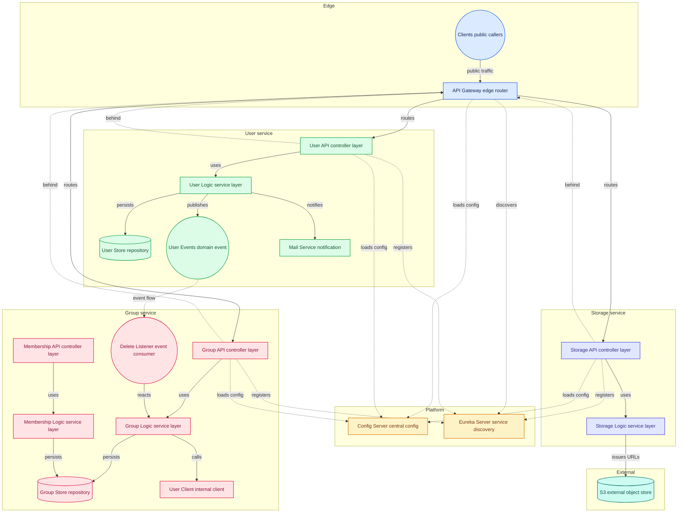

# NexDrive Backend

---

The backend follows a decoupled, event-driven ecosystem structured across eight domain-driven microservices.

Key Architectural Pillars:

* Database-per-Service: Each microservice owns its private datastore (mixing relational and non-relational systems) to enforce loose coupling and independent        scalability.

* Multi-Tenancy Isolation: Implements logical data segregation using the Admin ID as the Tenant Identifier embedded inside service-to-service headers. This          prevents data leaks between independent educational centers.

* Composite Pattern for Hierarchical Storage: Folders and files are structured via composite entity patterns to permit infinite nesting with performant tree-        traversal indexing.

* Asynchronous Offloading: Time-consuming operations (e.g., file metadata indexing, audit log generation, and notifications) are offloaded to an event bus to keep   the user-facing APIs highly responsive.

---

## 🗺️ System Architecture

